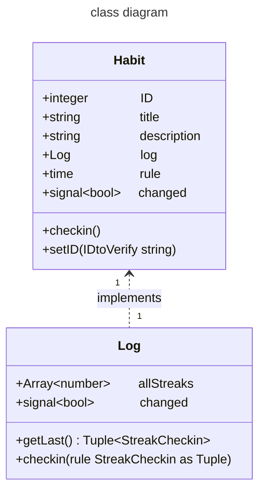
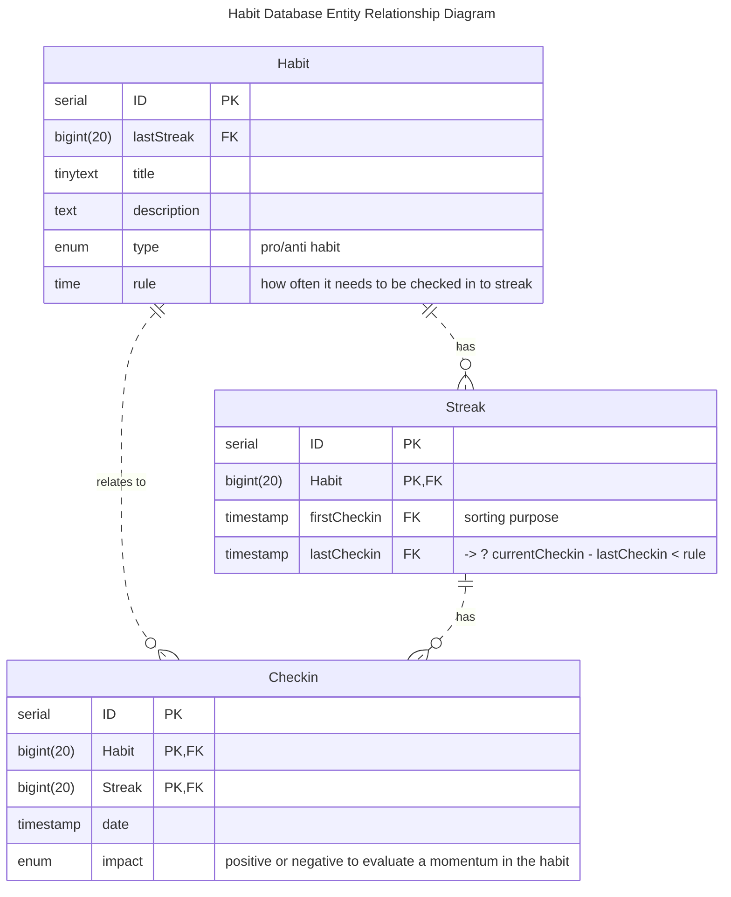

# Habittracker
habittracking - but forgiving. Can't miss a streak? revive it and build momentum!

## Classes

```mermaid
---
title: class diagram
---
classDiagram
    Habit "1" <.. "1" Log : implements

    class Habit{ 
      %%<<Interface>>%%
      +integer               ID
      +string                 title
      +string                 description
      +Log                    log
      +time                   rule
      +signal~bool~     changed 
      +checkin()
      +setID(IDtoVerify string)
    } 

    class Log{ 
      %%<<Service>>%%
      +Array~number~        allStreaks
      +signal~bool~             changed 
      +getLast() Tuple~StreakCheckin~
      +checkin(rule StreakCheckin as Tuple)
    }
```

## Backend
### Database

```mermaid
---
title: Habit Database Entity Relationship Diagram
---
erDiagram
    Habit ||..o{ Streak : has
    Habit ||..o{ Checkin : "relates to"
    Streak ||..o{ Checkin : has

    Habit {
      serial ID PK
      bigint(20) lastStreak FK
      tinytext title
      text description
      enum type "pro/anti habit"
      time rule "how often it needs to be checked in to streak"
    }

    Streak {
      serial ID PK
      bigint(20) Habit PK,FK
      timestamp firstCheckin FK "sorting purpose"
      timestamp lastCheckin FK "-> ? currentCheckin - lastCheckin < rule"
    }

    Checkin {
      serial ID PK
      bigint(20) Habit PK,FK
      bigint(20) Streak PK,FK
      timestamp date
      enum impact "positive or negative to evaluate a momentum in the habit"
    }
```
