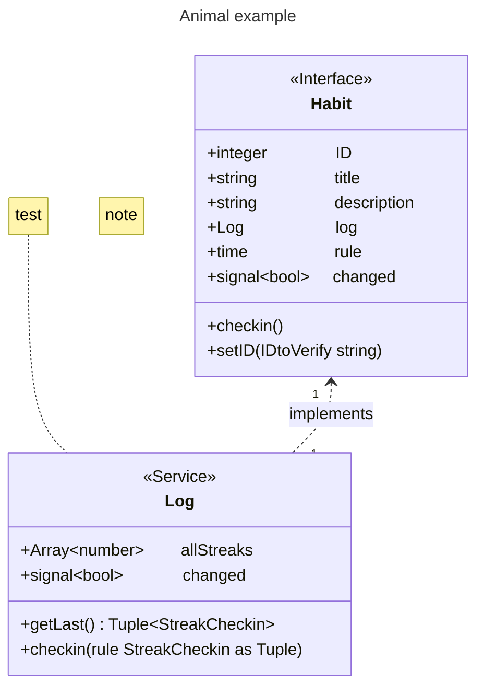

## Classes

```mermaid
---
title: Animal example
---
classDiagram
    note "note"
    note for Log "test"
    Habit "1" <.. "1" Log : implements

    class Habit{ <<Interface>> 
      +integer               ID
      +string                 title
      +string                 description
      +Log                    log
      +time                   rule
      +signal~bool~     changed 
      +checkin()
      +setID(IDtoVerify string)
    } 

    class Log{ <<Service>>
      +Array~number~        allStreaks
      +signal~bool~             changed 
      +getLast() Tuple~StreakCheckin~
      +checkin(rule StreakCheckin as Tuple)
    }

```
